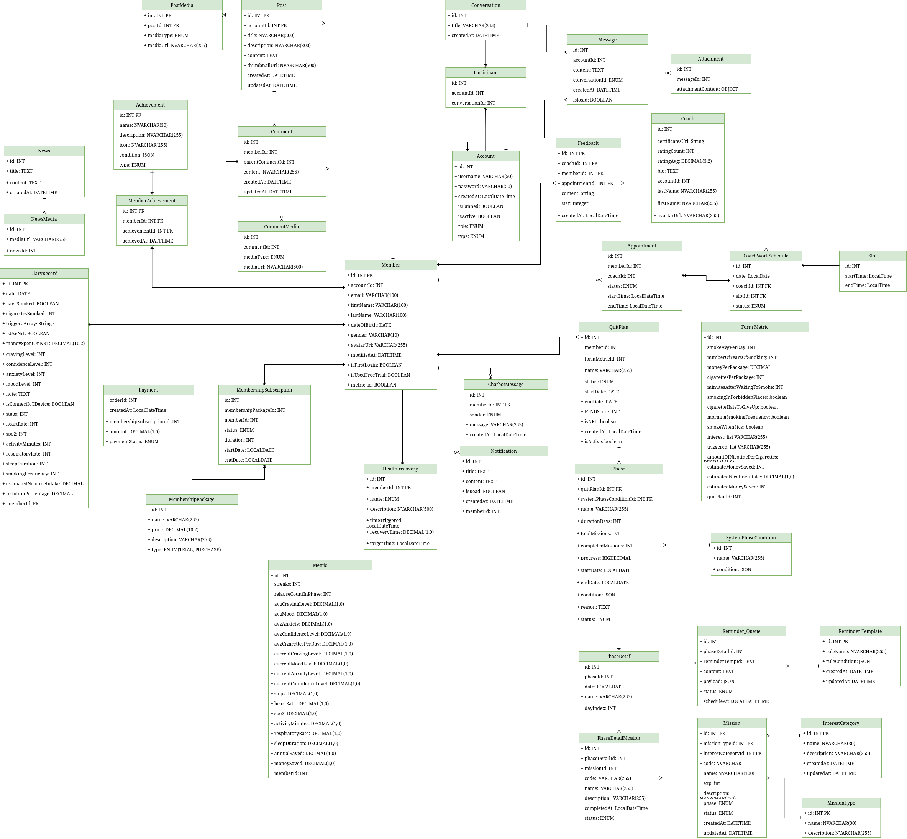
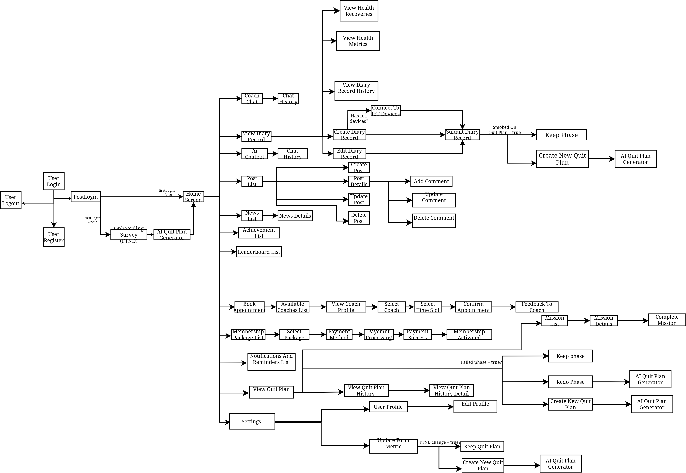
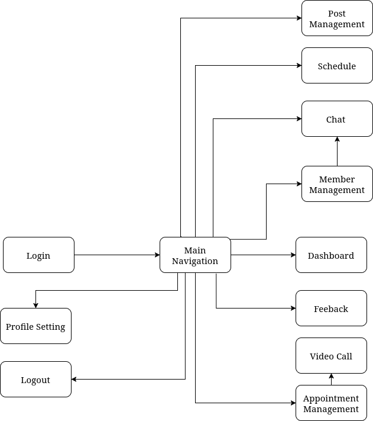
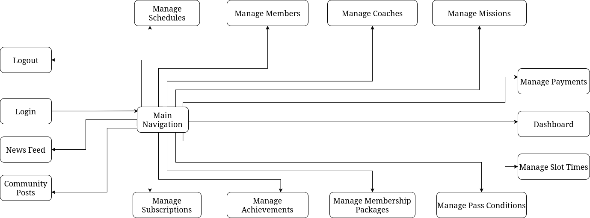
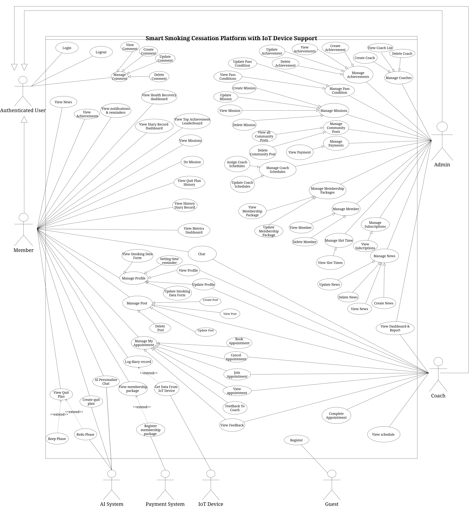

# SmartQuitIoT

  

  <strong>Smart Smoking Cessation Platform with IoT Device Support</strong>

  
  
  

---

## Table of Contents

- [Introduction](#introduction)
- [Key Features & Scope](#key-features--scope)
- [Technology Stack](#technology-stack)
- [System Architecture & Design](#system-architecture--design)
- [Team Members & Supervisors](#team-members--supervisors)
- [Project Resources](#project-resources)

---

## Introduction

**SmartQuitIoT** is an intelligent smoking cessation support platform designed to bridge the gap between personal willpower and data-driven healthcare. By integrating **Artificial Intelligence (AI)** with **IoT wearable devices**, the system continuously monitors biometric indicators (heart rate, SpO₂, step count, sleep duration) to generate evidence-based, personalized quit plans.

### Vision

Create a world where anyone can access professional, personalized support to quit smoking through AI coaches and human experts to improve adherence to quit plans and track measurable health progress.

### Solution Architecture

The solution consists of two main interfaces backed by a robust backend:

- **Mobile Application (Member)**: A personal companion for users to track habits, sync IoT data, receive AI advice, and chat with coaches.
- **Web Portal (Coach & Admin)**: A management dashboard for coaches to monitor member health data, manage video call appointments and for admins to manage the system.

---

## Key Features & Scope

### Member (Mobile App)

- **Personalized AI Plans**: Generate quit plans and missions based on user metrics and smoking history
- **IoT Integration**: Sync health data (Heart rate, SpO₂, Steps, Sleep duration) from smart watch via 3rd party software.
- **Tracking & Analytics**: Log daily smoking diaries, track expenditures, and visualize health recovery timelines
- **Consultation**: Chat with AI Assistant or book appointments/chat directly with human Coaches
- **Gamification**: Earn achievements, view leaderboards, and receive motivational notifications

### Coach (Web Portal)

- **Member Monitoring**: View member profiles and analyzed health data to provide accurate advice
- **Consultation**: Conduct online chat consultations and manage appointment schedules

### Admin (Web Portal)

- **System Management**: Manage Members, Coaches, Community Posts, and News
- **Configuration**: Manage Membership packages, Achievement criteria, and System Pass conditions
- **Analytics**: View overall system reports and dashboards

---

## 🛠️ Technology Stack

### Frontend

### Backend (Core Service)

### AI

### Database & Caching

### Message Broker

### AI Models & Integration

**Pre-trained Models:**
- `unitary/toxic-bert` - Toxic content detection
- `Falconsai/nsfw_image_detection` - NSFW image classification
- `openai/whisper-small` - Speech-to-Text
- `microsoft/speecht5_tts` - Text-to-Speech
- `microsoft/speecht5_hifigan` - Audio vocoder

**Custom ONNX Models:**
- Success Prediction Model - Quit plan success probability
- Craving Time Model - Peak craving forecasting (96 time slots/day)

### Development Tools & IDEs

### Design & Modeling

### Testing & Quality Assurance

### DevOps & Infrastructure

### Monitoring & Observability

### Third-Party Integrations

### Technology Overview Table

| **Category** | **Technology** | **Purpose** |
|--------------|----------------|-------------|
| **Frontend (Mobile)** | Flutter | Cross-platform mobile application development |
| **Frontend (Web)** | React JS | Interactive web dashboard for Admins and Coaches |
| **Backend (Core)** | Java 21 / Spring Boot 3.5.6 | Core business logic and RESTful API services |
| **Backend (AI Service)** | Python 3.10+ / FastAPI | AI microservice for ML predictions and content moderation |
| **Database** | MariaDB 12.1.2 | Primary relational database management system |
| **Cache Layer** | Redis 8.4.0 | Session management and response caching |
| **Search Engine** | Elasticsearch 9.2.3 | Full-text search for posts, news, and content |
| **Message Broker** | RabbitMQ 4.2.2 | Event-driven async communication between services |
| **ML Framework** | PyTorch + Transformers | Model training and NLP/audio processing |
| **ML Runtime** | ONNX Runtime | Optimized inference for custom trained models |
| **LLM Integration** | OpenAI GPT / Google Gemini | AI-powered personalized quit plans and chatbot |
| **Real-time Communication** | Spring WebSocket + Agora | In-app messaging and video consultations |
| **Testing** | JUnit 5, Mockito, Pytest | Comprehensive unit and integration testing |
| **Code Quality** | Black, Flake8, CodeQL | Automated formatting and security analysis |
| **CI/CD** | GitHub Actions | Automated testing, building, security scanning, and deployment |
| **Containerization** | Docker, Podman | Application containerization and orchestration |
| **Monitoring** | Prometheus, Grafana, Loki | Metrics collection, visualization, and log aggregation |
| **Security Scanning** | Trivy, CodeQL | Vulnerability detection and static analysis |
| **Payment Gateway** | PayOS | Vietnamese payment processing |
| **Email Service** | Mailpit | Transactional and notification emails |
| **Build Tools** | Maven (Java), pip (Python) | Dependency management and build automation |
| **Design Tools** | DrawIO, Visual Paradigm | System architecture and database modeling |
| **Deployment** | Self-hosted VPS | Production environment hosting |

---

### Microservices Architecture

**Backend Core Service (Port 8080)**
- RESTful API endpoints
- Business logic processing
- Database operations (MariaDB)
- User authentication & authorization
- Real-time WebSocket connections
- Integration with third-party services (PayOS, Agora, Brevo)
- Message publishing to RabbitMQ
- OpenAI/Gemini integration for conversational AI

**AI Microservice (Port 8000)**
- Machine learning model inference
- Content moderation (text toxicity, NSFW detection)
- Speech-to-Text / Text-to-Speech processing
- Custom ONNX model predictions:
  - Quit success probability
  - Peak craving time forecasting
- Diary sentiment analysis
- Weekly health summary generation
- Visual report generation
- Model training and retraining endpoints

---

### AI Models & Capabilities

#### Content Moderation
- **Text Classification**: `unitary/toxic-bert` - Detects toxic, profane, or harmful text
- **NSFW Detection**: `Falconsai/nsfw_image_detection` - Image content safety classification
- **Video Moderation**: Frame-by-frame NSFW detection for uploaded videos

#### Audio Processing
- **Speech-to-Text**: `openai/whisper-small` - Accurate voice transcription for diary entries
- **Text-to-Speech**: `microsoft/speecht5_tts` + `speecht5_hifigan` - Natural voice synthesis

#### Custom Trained Models (ONNX)
- **Success Prediction Model**: Predicts quit plan success probability based on:
  - User demographics (age, gender)
  - Smoking history (FTND score, cigarettes/day, years smoking)
  - Health metrics (heart rate, SpO2, sleep quality)
  - Behavioral data (mood, anxiety levels)
  
- **Peak Craving Time Model**: Forecasts craving intensity across 96 daily time slots (15-min intervals):
  - Input features: hour, day of week, user profile, current mood/anxiety
  - Output: Craving risk score (0-10) for each 15-minute interval
  - Enables proactive intervention notifications

#### LLM-Powered Features
- Personalized quit plan generation
- AI coaching conversations with context memory
- Sentiment analysis of daily diary entries
- Weekly progress summaries for coaches
- Real-time intervention messages for high-risk periods

---

### CI/CD Pipeline Features

#### Automated Workflows
**Java Backend Pipeline:**
- ✅ Maven build and compilation
- ✅ JUnit unit tests with Surefire reports
- ✅ Docker image build and push to GHCR
- ✅ Semantic versioning with Git tags
- ✅ Automated deployment to VPS

**Python AI Service Pipeline:**
- ✅ Dependency installation with pip caching
- ✅ Black code formatting validation
- ✅ Pytest unit test execution
- ✅ System dependency installation (OpenCV, ML libs)
- ✅ Docker multi-stage build optimization
- ✅ Trivy security vulnerability scanning
- ✅ Discord notifications for build status

**Security & Maintenance:**
- Weekly CodeQL static analysis
- Weekly Dependabot dependency updates
- Automated Black formatting on push
- Container image security scanning with severity thresholds

#### Quality Gates
- All tests must pass before Docker build
- Critical/High severity vulnerabilities block deployment
- Code formatting validation prevents unformatted code merges
- Health checks ensure service availability before traffic routing

#### Deployment Strategy
- Multi-stage Docker builds for minimal image size
- Layer caching with GitHub Actions cache
- Semantic versioning (major.minor.patch)
- Health check integration with service dependencies
- Zero-downtime deployment with health probes
---

## System Architecture & Design

###  Database Design

The system utilizes a relational database to manage users, health logs, quit plans, and IoT data.

  
   
  <em>Entity Relationship Diagram</em>

### Architecture Diagram

SmartQuitIoT follows a client-server architecture with real-time capabilities for chat and IoT synchronization.

  
   
  <em>System Architecture Overview</em>

### Screen Flow 

  
   
  <em>Member Screen Flow Diagram</em>

  
   
  <em>Coach Screen Flow Diagram</em>

  
   
  <em>Admin Screen Flow Diagram</em>

### Use Case

  
   
  <em>Use Case Diagram</em>

---

## Team Members & Supervisors

### Group **GFA25SE97**

| **Name** | **Role** | **Student ID** | **Email** |
|----------|----------|----------------|-----------|
| Nguyen Hai Linh | Leader | SE170530 | linhnhse170530@fpt.edu.vn |
| Thi Minh Dat | Member | SE170508 | dattmse170508@fpt.edu.vn |
| Nguyen Ha Viet Anh | Member | SE172136 | anhnhvse172136@fpt.edu.vn |
| Tran Ngoc Kinh Luan | Member | SE184059 | luantnkse184059@fpt.edu.vn |

### Supervisor

**Do Tan Nhan**  
nhandt35@fe.edu.vn

---

## Project Resources

  
  
  

---

  © 2025 SmartQuitIoT - FPT University Capstone Project

